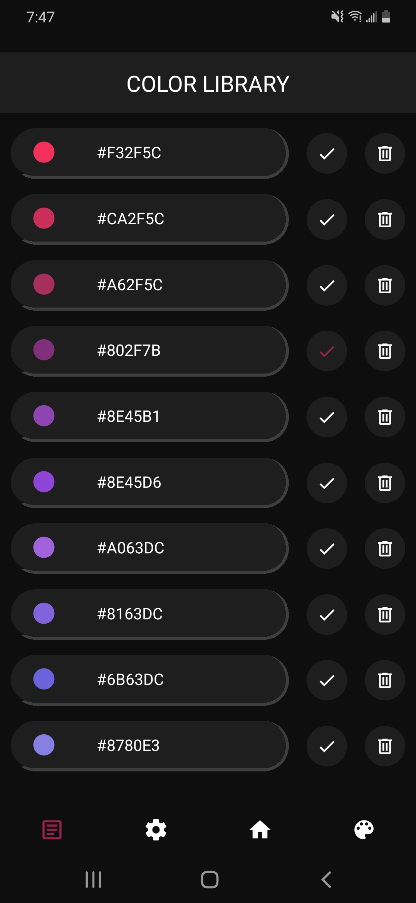
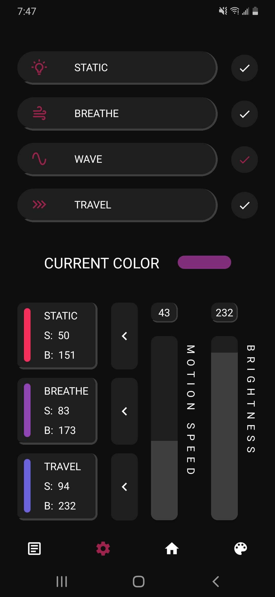
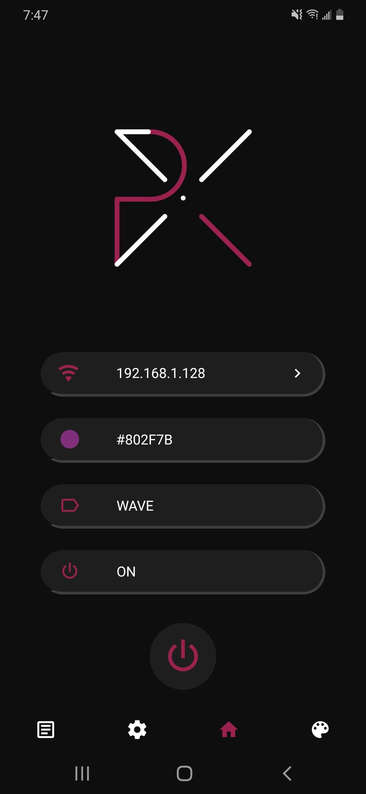
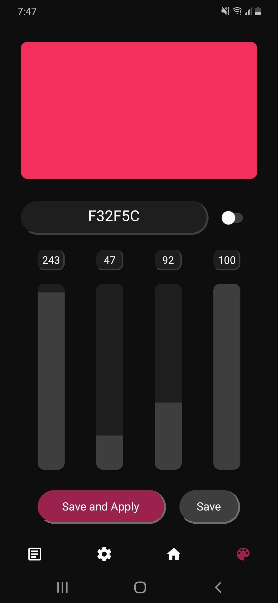

# Pyxelite

Pyxelite is an open source mobile ARGB controller written in React Native for web server based ARGB microcontrollers.

This project is currently in alpha and only available for android, support for iOS and desktop are currently under development. The latest stable release apk can be found <a href='https://github.com/lochungtin/Pyxelite/releases'>here</a>.

## Micro Controller

The microcontroller used in this project is an ESP32, but any other device that supports web server hosting would be suitable for this application. The repo and code for the microcontroller can be found <a href='https://github.com/lochungtin/ESPyxelite'>here</a>.

## Official Pyxelite Website

For more information about the application, visit the Pyxelite official website. (currently not available)

## Gallery

Screenshots of each section of the mobile app.

| COlOR LIBRARY                                 | CONTROL PANEL                                  | HOMEPAGE                                   | RGBA COLOR PICKER                           |
| --------------------------------------------- | ---------------------------------------------- | ------------------------------------------ | ------------------------------------------- |
|  |  |  |  |

## Building From Source

Building from source has only been tested on android devices, but theoretically it should be also available on iOS as react native supports both operating systems.

1. git clone the repo
    - ```git clone https://github.com/lochungtin/Pyxelite.git```
2. cd into the repo
    - ```cd /path/to/repo/Pyxelite```
3. install all required dependencies (setup react native if not already done so)
    - ```npm install```
4. build the app and run on device
    - ```npx react-native run-android```

## Future Plans

1. Release on Google Play Store

2. IOS release

3. Desktop application 
