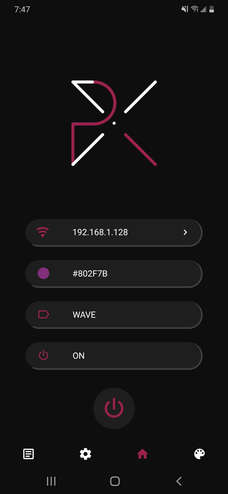
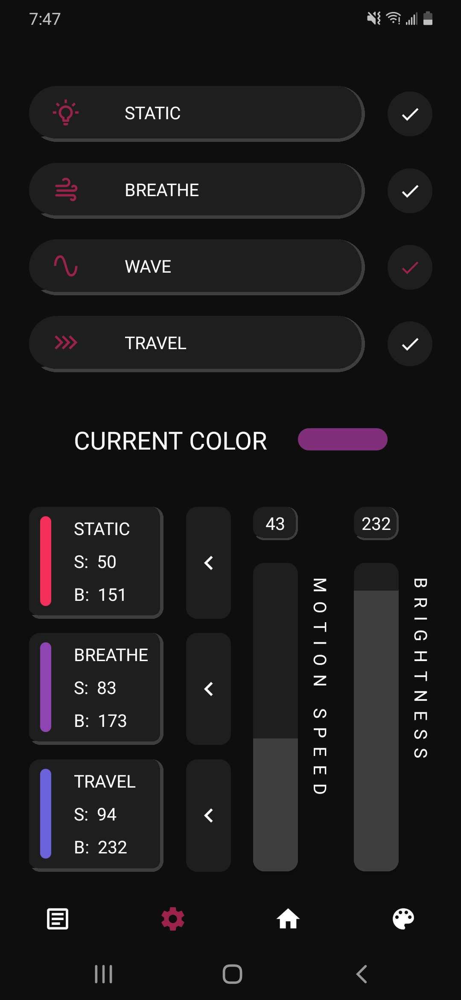

# Mobile App

## About

|||
|:--:|:--|
||Pyxelite is an open source mobile ARGB controller written in React Native for the ARGB microcontroller, which is the other part of the project.|

This project is currently in alpha and only available for android, support for desktop support is planned while iOS currently has no intention of being support. The latest stable release apk can be found [Here](https://github.com/lochungtin/Pyxelite/releases/download/v1.0.0-alpha/Pyxelite-AlphaV1.0.0.apk).

## Features

### Basic Control and Animations

|||
|:--:|:--|
||There are currently 4 supported animations in the app and the MCU, they are: **Static (default)**, **Breathe**, **Wave**, and **Travel**|

### Custom Brightness and Motion Speed

Animation speed and brightness can be configured to the user's liking, the scale is from **0 to 255**, for both speed and brightness.

### Custom Colours and Colour Library

Colours can be created using the **colour creation tool** and saved to a locally maintained **colour library**, where colours can be selected and sent to the MCU.

## Limitations and Future Work

Currently, only one colour is support for the entire system. Upcoming versions of the project is to allow **different colours and configurations** for every single ARGB device connected.
